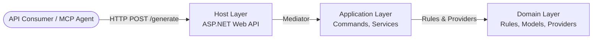
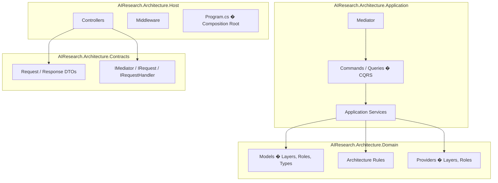
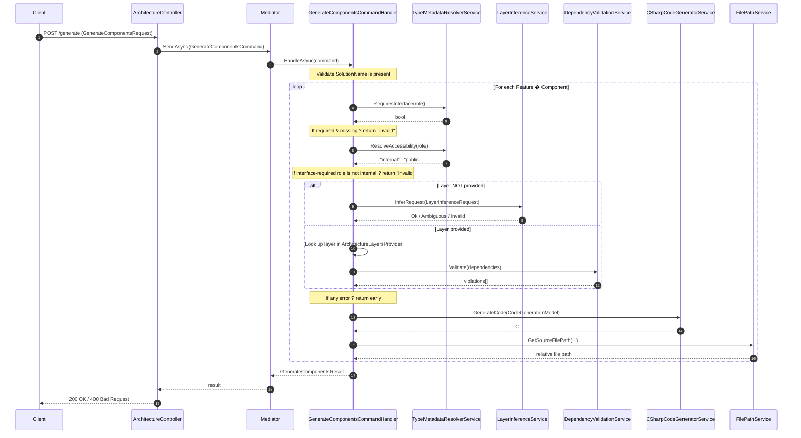
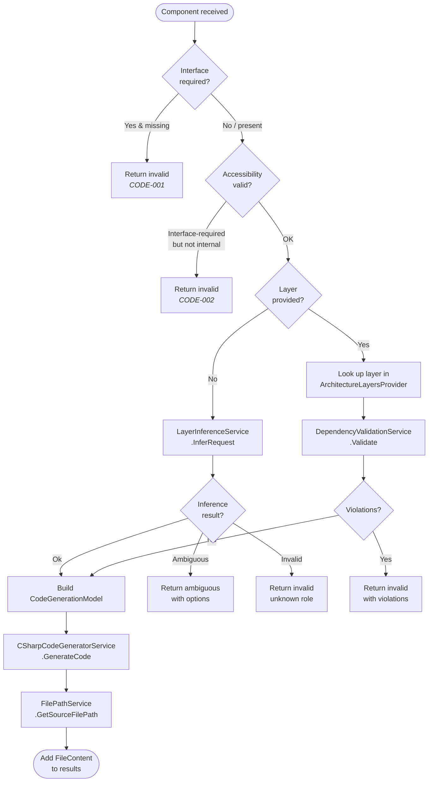
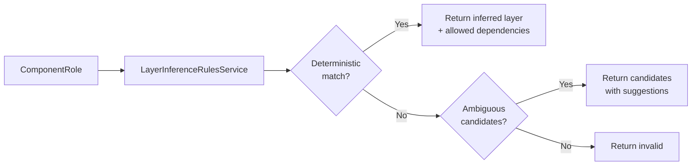
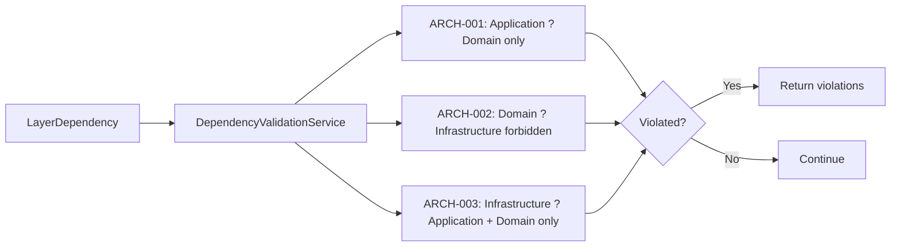
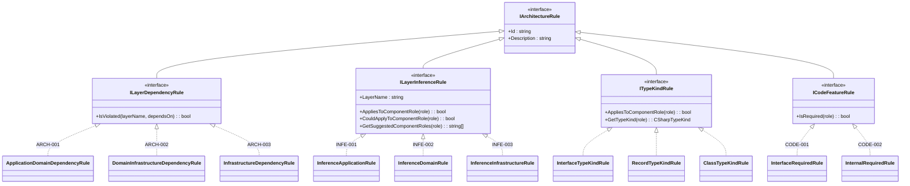
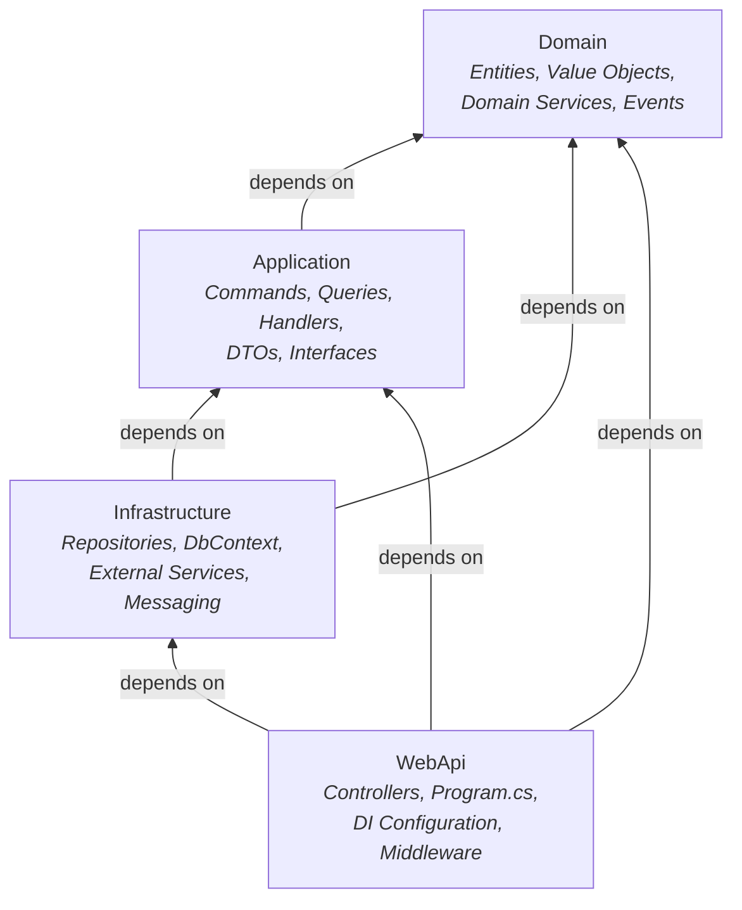

# Generate Flow Architecture

## 1. Overview

**AIResearch.Architecture** is a .NET 10 Web API that acts as an **architecture-aware code generation engine**. It enforces Clean Architecture rules at code-generation time � callers describe *what* they want (component role, name, feature) and the system decides *where* it goes, *how* it's shaped, and whether the request is even allowed.

The most important endpoint is **`POST /v1/Architecture/generate`**, which is, together with the supporting structures behind it, the focus of this document, the **`'generate' flow`**.



---

## 2. Solution Structure

The solution is organised into four projects that mirror a classic Clean Architecture layering:



| Project | Responsibility |
|---|---|
| **Host** | ASP.NET entry point, controllers, middleware (logging, global exception handling), Swagger, API versioning, MCP manifest. |
| **Application** | CQRS command/query handlers, orchestration services (inference, validation, code generation), the `Mediator` implementation. |
| **Contracts** | Shared DTOs (`GenerateComponentsRequest`, `GenerateComponentsResponse`, etc.) and mediator abstractions (`IMediator`, `IRequest<T>`, `IRequestHandler<TReq,TRes>`). |
| **Domain** | Pure domain logic: architecture layer definitions, component role metadata, and all architecture rule implementations. Zero external dependencies. |

---

## 3. The Generate Endpoint � Request Flow

### 3.1 Entry Point

```
POST /v{version}/Architecture/generate
```

The `ArchitectureController.Generate` method receives a `GenerateComponentsRequest` containing:

| Field | Purpose |
|---|---|
| `SolutionName` | Root namespace prefix and solution file name (e.g. `IaResearch.OrderService`). |
| `Features` | Bounded contexts to scaffold. Each has a `Name` and optional `ApplicationKind`. |
| `Components` | Individual C# types to generate. Each has a required `ComponentRole` and `Name`, plus optional `Layer`, `Dependencies`, `Commands`, `Comments`, and `ImplementsInterfaces`. |

### 3.2 End-to-End Sequence



---

## 4. Processing Steps in Detail

### Step 1 � Controller & Mediator Dispatch

The controller wraps the incoming DTO into a `GenerateComponentsCommand` and sends it through the custom `Mediator`. The mediator resolves the matching `IRequestHandler<GenerateComponentsCommand, GenerateComponentsResult>` from the DI container via reflection and invokes `HandleAsync`.

### Step 2 � Request Validation

`GenerateComponentsCommandHandler` first checks that `SolutionName` is non-empty. If missing, an `"invalid"` result is returned immediately.

### Step 3 � Per-Component Processing Loop

For every combination of **Feature � Component**, the handler runs the following pipeline:



#### 3a � Interface Requirement Validation (CODE-001)

The `TypeMetadataResolverService` consults the domain's `InterfaceRequiredRule` (rule **CODE-001**) which delegates to `ComponentRoleProvider`. If the role's metadata has `RequiresInterface = true` and the request has no `ImplementsInterfaces`, the request is rejected with a suggested interface name (`I{ComponentName}`).

#### 3b � Accessibility Validation (CODE-002)

The `InternalRequiredRule` (rule **CODE-002**) enforces that non-interface types requiring an interface implementation must be `internal`. If the role requires an interface but is not an interface itself, and the resolved accessibility is not `internal`, the request is rejected.

#### 3c � Layer Resolution

**Path A � Layer Inference (no explicit layer)**



The `LayerInferenceService` delegates to `LayerInferenceRulesService` which iterates registered `ILayerInferenceRule` implementations:

| Rule | ID | Layer |
|---|---|---|
| `InferenceApplicationRule` | INFE-001 | Application |
| `InferenceDomainRule` | INFE-002 | Domain |
| `InferenceInfrastructureRule` | INFE-003 | Infrastructure |

Each rule extends `LayerInferenceRuleBase`, which consults `ComponentRoleProvider` to check if the given role has metadata pinning it to that layer. A deterministic match means exactly one rule claims the role. If none claim it deterministically but some could apply, the result is ambiguous with candidate options.

**Path B � Explicit Layer Validation**

When a layer is explicitly provided, the handler verifies it exists in `ArchitectureLayersProvider`, then validates the component's declared dependencies against the architecture's dependency rules using `DependencyValidationService`.

#### 3d � Dependency Validation



The `DependencyValidationService` collects all registered `ILayerDependencyRule` instances and checks each declared dependency pair:

| Rule | ID | Enforces |
|---|---|---|
| `ApplicationDomainDependencyRule` | ARCH-001 | Application may only depend on Domain |
| `DomainInfrastructureDependencyRule` | ARCH-002 | Domain must not depend on Infrastructure |
| `InfrastructureDependencyRule` | ARCH-003 | Infrastructure may depend on Application and Domain only |

#### 3e � Code Generation

Once all validations pass, a `CodeGenerationModel` is built and handed to `CSharpCodeGeneratorService`, which:

1. **Builds the namespace** via `NamespaceService` ? `{SolutionName}.{Feature}.{Layer}`.
2. **Generates using statements** for declared dependencies.
3. **Resolves the C# type kind** via `TypeMetadataResolverService` ? consults `ITypeKindRule` implementations to map component role ? `Class`, `Record`, `Interface`, `Struct`, or `RecordStruct`.
4. **Resolves accessibility** (`public` / `internal`).
5. **Generates the type declaration** with inheritance clauses, method stubs, and comments.
6. **Formats the code** using Roslyn's `Formatter`.

#### 3f � File Path Resolution

`FilePathService` computes the output path: `src/{SolutionName}.{Feature}.{Layer}/{ComponentName}.cs`.

### Step 4 � Response Assembly

All generated `FileContent` items are collected and returned as a dictionary of `path ? code` in the response with `status: "ok"`. Any early exit produces an error response with status `"invalid"` or `"ambiguous"`.

---

## 5. Architecture Rules � Complete Taxonomy



### Rule Summary

| Category | ID | Rule | Description |
|---|---|---|---|
| **Dependency** | ARCH-001 | `ApplicationDomainDependencyRule` | Application layer may only depend on Domain. |
| **Dependency** | ARCH-002 | `DomainInfrastructureDependencyRule` | Domain layer must not depend on Infrastructure. |
| **Dependency** | ARCH-003 | `InfrastructureDependencyRule` | Infrastructure may depend on Application and Domain only. |
| **Inference** | INFE-001 | `InferenceApplicationRule` | Maps roles like `Command`, `CommandHandler`, `Query`, `ApplicationService` ? Application layer. |
| **Inference** | INFE-002 | `InferenceDomainRule` | Maps roles like `Entity`, `ValueObject`, `Aggregate`, `DomainService` ? Domain layer. |
| **Inference** | INFE-003 | `InferenceInfrastructureRule` | Maps roles like `Repository`, `Gateway`, `DbContext` ? Infrastructure layer. |
| **Type Kind** | � | `InterfaceTypeKindRule` | Resolves interface roles ? `CSharpTypeKind.Interface`. |
| **Type Kind** | � | `RecordTypeKindRule` | Resolves record roles (Command, Query, ValueObject, etc.) ? `CSharpTypeKind.Record`. |
| **Type Kind** | � | `ClassTypeKindRule` | Default fallback ? `CSharpTypeKind.Class`. |
| **Code Feature** | CODE-001 | `InterfaceRequiredRule` | Roles like `Repository`, `CommandHandler`, `ApplicationService` must have an interface. |
| **Code Feature** | CODE-002 | `InternalRequiredRule` | Non-interface types that require an interface must be `internal` (interface is `public`). |

---

## 6. The Architecture Layers

The `ArchitectureLayersProvider` defines four layers with strict dependency rules:



| Layer | Allowed Dependencies |
|---|---|
| **Domain** | *(none)* |
| **Application** | Domain |
| **Infrastructure** | Application, Domain |
| **WebApi** | Infrastructure, Application, Domain |

---

## 7. Component Role System

The `ComponentRoleProvider` is the single source of truth for all supported component roles. Each role defines:

- **Name** � The canonical role identifier (e.g. `CommandHandler`).
- **TypeKind** � The C# type to generate (`Class`, `Record`, `Interface`, `Struct`, `RecordStruct`).
- **Layer** � The owning architecture layer.
- **RequiresInterface** � Whether an interface implementation is mandatory.
- **AlternativeNames** � Aliases that resolve to this role.

The role metadata drives multiple subsystems simultaneously: layer inference, type kind resolution, interface requirement checks, and accessibility decisions.

---

## 8. Key Application Services

| Service | Responsibility |
|---|---|
| `LayerInferenceService` | Orchestrates layer inference: tries deterministic match first, then falls back to ambiguous candidates. |
| `LayerInferenceRulesService` | Iterates `ILayerInferenceRule` instances to find deterministic or ambiguous layer matches for a role. |
| `DependencyValidationService` | Evaluates all `ILayerDependencyRule` instances against declared dependencies. |
| `TypeMetadataResolverService` | Resolves type kind, accessibility, and interface requirements from `ITypeKindRule` and `ICodeFeatureRule` instances. |
| `CSharpCodeGeneratorService` | Generates formatted C# source code using Roslyn, applying namespace, type declaration, and method stubs. |
| `NamespaceService` | Builds namespaces following the pattern `{SolutionName}.{Feature}.{Layer}`. |
| `FilePathService` | Computes output file paths: `src/{Project}/{ComponentName}.cs`. |
| `LayerDependencyService` | Resolves allowed dependencies for a given layer from `ArchitectureLayersProvider`. |

---

## 9. Cross-Cutting Concerns

- **Mediator Pattern** � All controller actions dispatch through `IMediator`, decoupling HTTP concerns from business logic.
- **Global Exception Handling** � `GlobalExceptionHandler` catches unhandled exceptions and returns RFC 7807 Problem Details.
- **Request Logging** � `RequestLoggingMiddleware` logs full request/response bodies for diagnostics.
- **API Versioning** � URL-segment versioning (`/v1/...`) via `Asp.Versioning`.
- **MCP Integration** � Custom `[McpAction]` and `[McpExample]` attributes enable discovery by AI agents through a generated MCP manifest.
