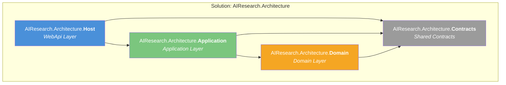
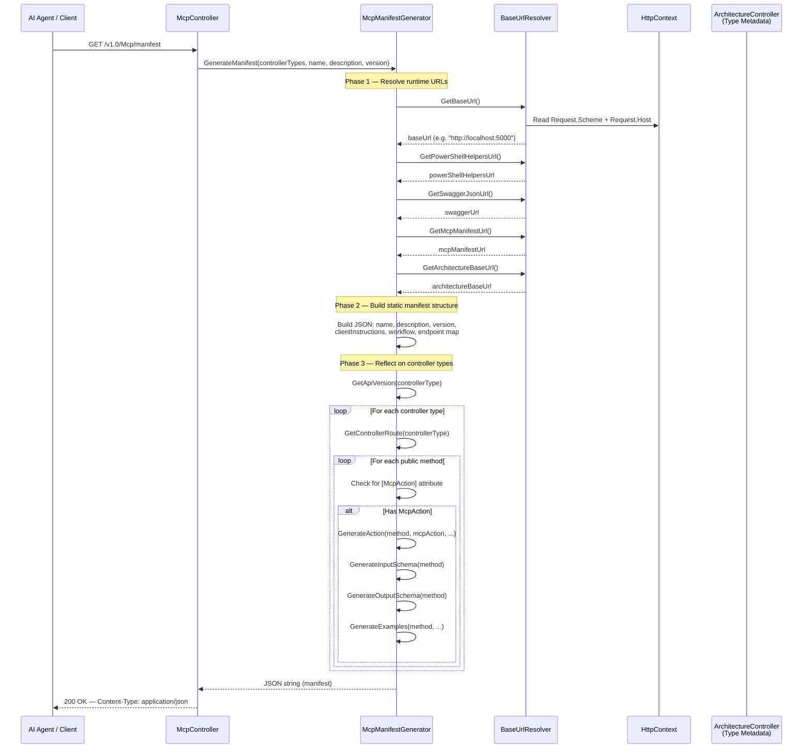
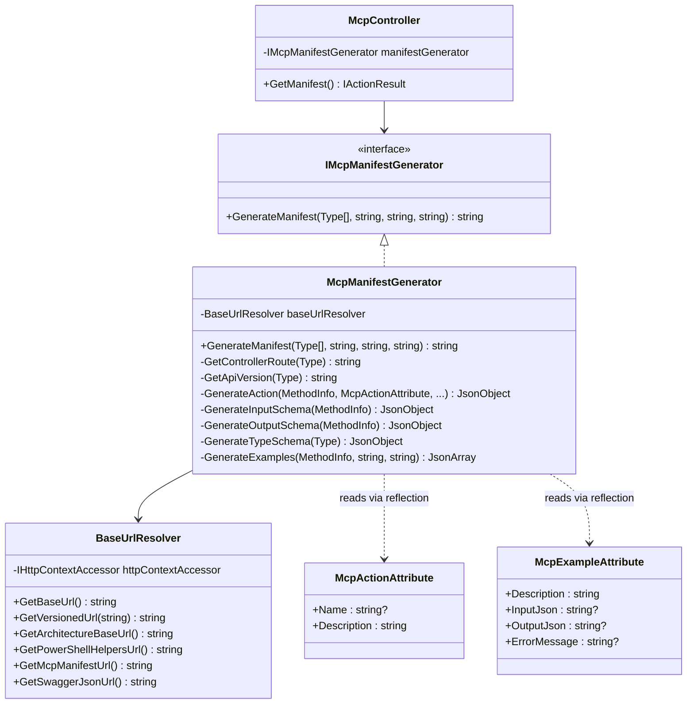
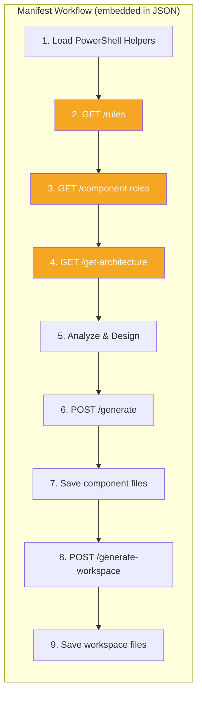
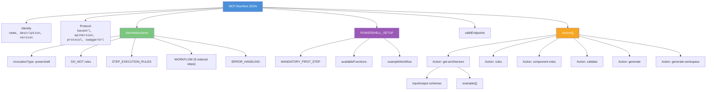
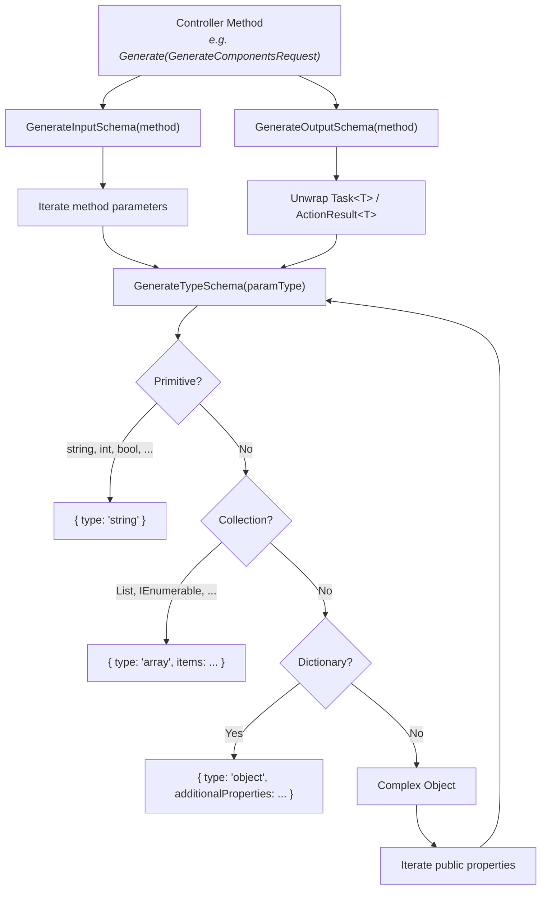
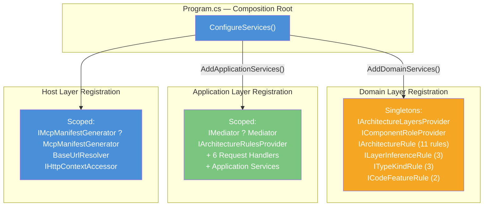

# MCP Manifest Endpoint — Architecture Flow

> High-level architecture document describing how the `/v1.0/Mcp/manifest` endpoint processes its request, flows through the application layers, and leverages architecture rules to produce the final JSON manifest.

---

## 1. Solution Structure Overview

The solution follows a **Clean Architecture** pattern with four projects, each mapping to a distinct architectural layer:



| Project | Layer | Responsibility |
|---------|-------|----------------|
| `AIResearch.Architecture.Host` | WebApi | Controllers, middleware, MCP manifest generation, DI composition root |
| `AIResearch.Architecture.Application` | Application | Use cases, mediator, application services, architecture rules aggregation |
| `AIResearch.Architecture.Domain` | Domain | Architecture rules, layer definitions, component role metadata, type kind rules |
| `AIResearch.Architecture.Contracts` | Shared | DTOs, request/response models, mediator abstractions |

---

## 2. Manifest Endpoint — Request Flow

The manifest endpoint is exposed as `GET /v1.0/Mcp/manifest`. Its purpose is to generate a fully self-describing JSON document that an AI agent can consume to understand the available API, its rules, workflow, and invocation protocol.

### 2.1 Sequence Diagram



### 2.2 Step-by-step Walkthrough

1. **HTTP Entry** — The request arrives at `McpController.GetManifest()` via ASP.NET Core routing (`GET /v1.0/Mcp/manifest`).

2. **Delegation** — The controller delegates entirely to `IMcpManifestGenerator.GenerateManifest()`, passing:
   - The `ArchitectureController` type (as the source of discoverable actions)
   - Static metadata: MCP name, description, and version

3. **URL Resolution** — `McpManifestGenerator` uses `BaseUrlResolver` to compute all runtime-aware URLs (base URL, Swagger, PowerShell helpers, manifest, architecture endpoints) from the current `HttpContext`.

4. **Static Manifest Construction** — The generator builds the core JSON structure containing:
   - Identity fields (`name`, `description`, `version`)
   - Client instructions, workflow steps, and error-handling guidance
   - PowerShell setup and helper function catalog
   - Valid endpoint map

5. **Reflection-based Action Discovery** — The generator iterates over each controller type, reflecting on its public methods to find those decorated with `[McpAction]`. For each discovered action it builds:
   - **Input schema** — by inspecting method parameter types recursively
   - **Output schema** — by unwrapping `ActionResult<T>` / `Task<T>` return types
   - **Examples** — from `[McpExample]` attributes with PowerShell invocation snippets

6. **Response** — The JSON document is serialized and returned with `Content-Type: application/json`.

---

## 3. Component Architecture — Manifest Generation



---

## 4. How Architecture Rules Shape the Manifest

The manifest does not execute the architecture rules at request time. Instead, the rules are **indirectly embedded** into the manifest through three mechanisms:

### 4.1 Workflow Step References

The `clientInstructions.WORKFLOW` array in the manifest directs consuming AI agents to call architecture-aware endpoints (rules, component roles, architecture definition) **before** generating any code. This ensures the rules are loaded and consulted at the agent's runtime.



Steps 2–4 (highlighted) serve architecture rule data to the agent via separate API endpoints backed by the domain layer.

### 4.2 Action Schema Introspection

When the manifest generator reflects on `ArchitectureController`, it discovers all endpoints that expose architecture data:

| Action | HTTP Method | Description | Domain Service Involved |
|--------|-------------|-------------|-------------------------|
| `get-architecture` | GET | Returns layer definitions + style | `IArchitectureLayersProvider` |
| `rules` | GET | Returns all architecture rules | `IArchitectureRulesProvider` ? `IArchitectureRule[]` |
| `component-roles` | GET | Returns all valid component roles | `IComponentRoleProvider` |
| `validate` | POST | Validates code against rules | `ILayerDependencyRule[]`, `ICodeFeatureRule[]` |
| `generate` | POST | Generates code components | `ILayerInferenceRule[]`, `ITypeKindRule[]`, `ICodeFeatureRule[]` |
| `generate-workspace` | POST | Generates solution structure | `IArchitectureLayersProvider` |

### 4.3 Endpoint URL Assembly

The manifest constructs a `validEndpoints` section using `BaseUrlResolver`, providing the AI agent with exact URLs for every architecture-related endpoint:

```json
{
  "validEndpoints": {
    "get-architecture": "http://localhost:5000/v1.0/Architecture/get-architecture",
    "rules": "http://localhost:5000/v1.0/Architecture/rules",
    "component-roles": "http://localhost:5000/v1.0/Architecture/component-roles",
    "validate": "http://localhost:5000/v1.0/Architecture/validate",
    "generate": "http://localhost:5000/v1.0/Architecture/generate",
    "generate-workspace": "http://localhost:5000/v1.0/Architecture/generate-workspace"
  }
}
```

---

## 5. Manifest JSON Structure — Logical Map

The following diagram shows the top-level structure of the generated manifest JSON and how each section contributes to the AI agent's understanding:



---

## 6. Reflection Engine — Schema Generation

The `McpManifestGenerator` uses .NET reflection to automatically produce JSON Schema descriptions for every discovered action's inputs and outputs.



### Supported type mappings:

| .NET Type | JSON Schema Type |
|-----------|-----------------|
| `string` | `string` |
| `int`, `long` | `integer` |
| `bool` | `boolean` |
| `decimal`, `double`, `float` | `number` |
| `List<T>`, `IEnumerable<T>`, etc. | `array` with `items` |
| `Dictionary<K,V>` | `object` with `additionalProperties` |
| Complex object | `object` with `properties` (recursive) |

---

## 7. Dependency Injection Wiring



---

## 8. Key Design Decisions

| Decision | Rationale |
|----------|-----------|
| **Reflection-based action discovery** | Actions are auto-discovered from `[McpAction]` attributes — no manual manifest maintenance needed. Adding a new endpoint with the attribute automatically includes it in the manifest. |
| **Runtime URL resolution** | `BaseUrlResolver` reads `HttpContext` to produce environment-correct URLs, making the manifest portable across localhost, staging, and production. |
| **Rules as indirect content** | The manifest does not serialize all rules inline. Instead, it directs the AI agent to fetch rules at runtime via dedicated endpoints, keeping the manifest lightweight and rules always up-to-date. |
| **Controller type passed as parameter** | The manifest generator is decoupled from any specific controller. It accepts `Type[]`, making it reusable if additional controllers need to be exposed in the future. |
| **Clean Architecture layering enforced by the system it describes** | The solution itself follows the same Clean Architecture rules that its domain model defines — the architecture is self-documenting. |
