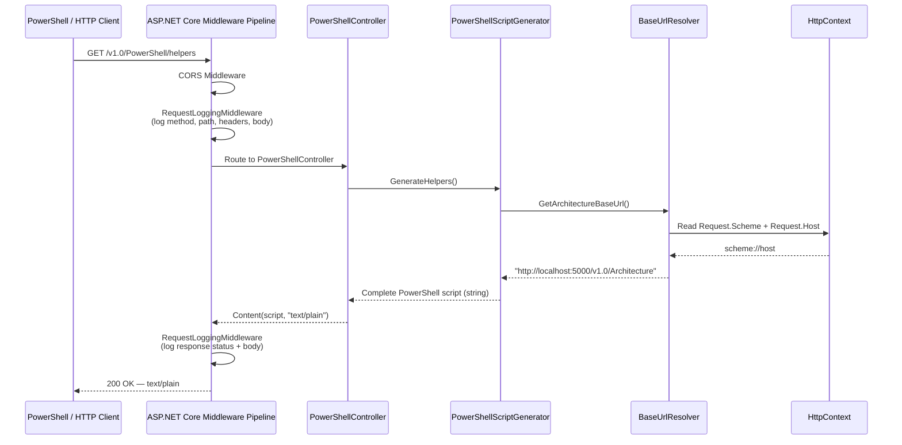
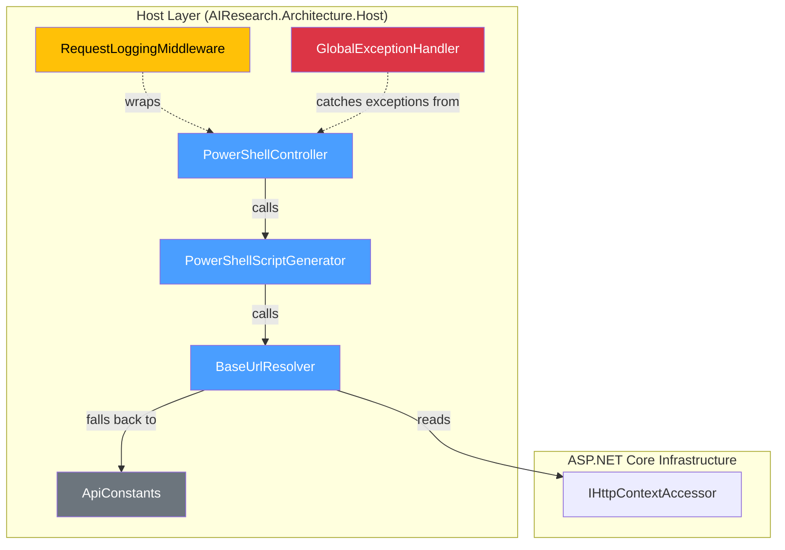
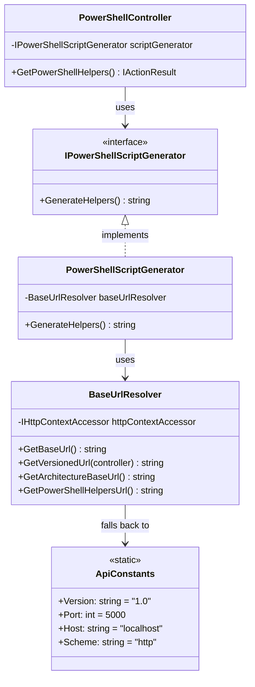
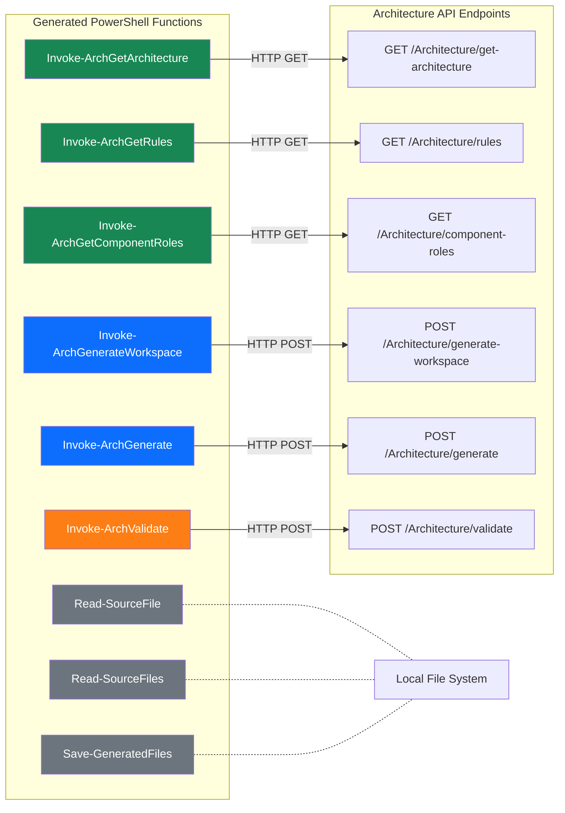

# PowerShell Helpers Endpoint — Architecture Flow

## 1. Overview

The PowerShell helpers endpoint (`GET /v{version}/PowerShell/helpers`) is a code-generation endpoint that dynamically produces a self-contained PowerShell script block. The generated script exposes ready-to-use wrapper functions for every Architecture API operation, effectively transforming the API into a copy-paste-and-call experience.

The primary motivation for introducing this layer is not human convenience alone — it is AI reliability. Early experiments allowed AI agents (such as GitHub Copilot) to invoke the MCP tool directly through raw API calls. In practice, this proved brittle. Even small deviations in request structure or parameter formatting significantly reduced success rates. Large language models are powerful pattern engines, but strict JSON contracts and precise HTTP semantics are unforgiving environments.

The generated PowerShell helpers act as a thin CLI façade over the Architecture API. Instead of asking an AI to construct perfectly shaped HTTP requests, we allow it to call well-named, strongly structured PowerShell functions. The complexity of endpoint routing, base URL resolution, headers, and payload formatting is centralized in one generated script. The AI interacts with stable command-like functions rather than low-level transport details.

Architecturally, the endpoint itself remains intentionally lightweight. The request does not traverse the Application or Domain layers. It delegates to a Host-layer service that resolves the runtime base URL and injects it into a predefined script template. The architectural depth lies not in the generation process, but in what the helpers expose. Each generated function ultimately calls an Architecture API operation, and those operations traverse the full Clean Architecture stack.

In essence, this endpoint generates a structured interaction surface for both humans and AI agents. It reduces ambiguity, increases invocation reliability, and preserves architectural boundaries — all while keeping the core system untouched.

---

## 2. High-Level Request Flow

---

## 3. Layer Involvement

The helpers endpoint touches only the **Host layer**. It is a pure infrastructure / presentation concern — no domain logic or application orchestration is needed to produce the script.

---

## 4. Component Responsibilities

### 4.1 `PowerShellController`

- Registered as an **ApiController** with API versioning (`v1.0`).
- Exposes a single `GET helpers` action.
- Receives `IPowerShellScriptGenerator` via **constructor injection** (primary constructor).
- Returns the generated script as `text/plain` content — not JSON — so consumers can copy-paste directly.

### 4.2 `IPowerShellScriptGenerator` / `PowerShellScriptGenerator`

- **Interface + implementation** pair registered as `Scoped` in the DI container.
- Single method: `GenerateHelpers() → string`.
- Composes a large interpolated string containing the full PowerShell script.
- The only dynamic element is the **base URL**, injected via `BaseUrlResolver`.
- All PowerShell function definitions, error handling, and user guidance text are embedded in the template.

### 4.3 `BaseUrlResolver`

- Resolves the API base URL at runtime from the current `HttpContext.Request`.
- Falls back to static defaults from `ApiConstants` when no HTTP context is available.
- Provides purpose-specific URL builders:
  - `GetArchitectureBaseUrl()` → `{base}/v1.0/Architecture`
  - `GetPowerShellHelpersUrl()` → `{base}/v1.0/PowerShell/helpers`

### 4.4 Middleware Pipeline

The request passes through two middleware components before reaching the controller:

| Middleware | Purpose |
|---|---|
| **CORS** | Allows any origin, method, and header (open policy). |
| **RequestLoggingMiddleware** | Logs the full request (method, path, headers, body) and the full response (status code, body). Buffers the response stream to capture output. |
| **GlobalExceptionHandler** | Catches unhandled exceptions and returns RFC 7231 `ProblemDetails`. Includes stack traces in Development mode. |

---

## 5. Class Diagram

---

## 6. What the Generated Script Produces

The generated PowerShell script is the **bridge** between the consumer and the full Architecture API. It produces the following functions, each targeting a specific Architecture API endpoint:

### Function Categories

| Category | Functions | Description |
|---|---|---|
| **Read-only queries** | `Invoke-ArchGetArchitecture`, `Invoke-ArchGetRules`, `Invoke-ArchGetComponentRoles` | Retrieve architecture metadata, rules, and valid component roles. |
| **Code generation** | `Invoke-ArchGenerateWorkspace`, `Invoke-ArchGenerate` | Generate solution structures and individual components. |
| **Validation** | `Invoke-ArchValidate` | Validate source files against architecture rules. |
| **Local utilities** | `Read-SourceFile`, `Read-SourceFiles`, `Save-GeneratedFiles` | File I/O helpers that operate on the local file system (never hit the API). |

### Built-in Error Handling

Every API-calling function uses a shared `$script:SafeRestMethod` script block that wraps `Invoke-RestMethod` with structured error handling — it reads the response stream on failure and throws a formatted `HTTP {StatusCode}: {Body}` message.

---

## 7. Key Design Decisions

| Decision | Rationale |
|---|---|
| **Script returned as `text/plain`** | Enables direct copy-paste into a PowerShell session without JSON parsing. |
| **Base URL resolved at request time** | Ensures the generated script uses the correct scheme and host, even behind reverse proxies or in containerized environments. |
| **Helpers endpoint stays in Host layer** | It is a presentation/infrastructure concern — no business logic is involved in script generation. |
